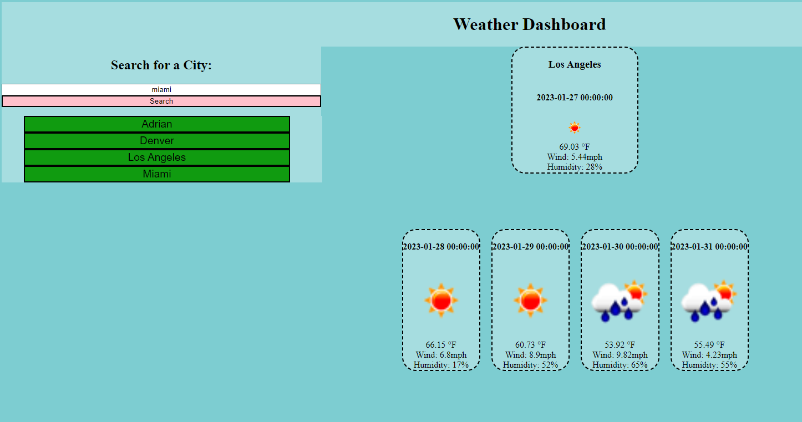

# Weather Forecast

## Description

The Weather Forecast is a web application that allows users to search for the weather of cities using the OpenWeatherMap API. This project was created to provide an opportunity to learn how to work with APIs and enable users to easily access weather information for any city they search for.

## Usage 

To use the Weather Forecast application, follow these steps:

    1. Open your web browser and visit https://cxrstings.github.io/weather-forecast/

    2. Once the page loads, you will see a search bar labeled "Search for a City."

    3. Enter the name of the city you want to search for in the input field and click the "Search" button.

    4. The application will retrieve the weather information for the specified city from the OpenWeatherMap API and display it on the screen.

    5. You can view the current weather conditions, including the city name, date, temperature, wind speed, and humidity.

    6. Additionally, you will find a forecast for the next four days, with information about each day's date, weather icon, temperature, wind speed, and humidity.

    7. To search for weather information of another city, simply enter the new city name in the search bar and click the "Search" button again.
    
    8. The application will update with the weather information for the newly searched city.

Enjoy exploring the weather forecast for different cities around the world!